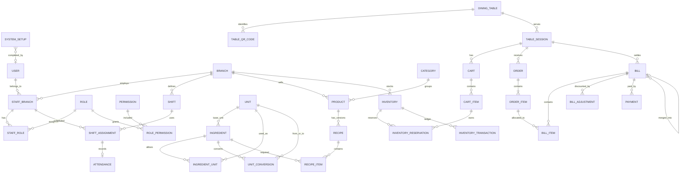

# DATABASE DESIGN - WEB ORDER QUAN NUOC/CA PHE

**Status:** COMPLETED  
**Version:** 1.1  
**Database:** PostgreSQL on Supabase  
**ORM:** Prisma  
**Last updated:** 2026-09-10

## 1. Overview

PostgreSQL is the source of truth for setup, auth mapping, RBAC, QR/table session, cart reservation, inventory, orders, bills, payments, attendance, idempotency, audit and realtime outbox.

Prisma defines models, relations and standard indexes. `backend/prisma/migrations/0001_database_invariants/migration.sql` adds PostgreSQL-only invariants such as partial unique indexes, CHECK constraints and triggers.

## 2. Domain Model

| Domain | Responsibility |
|---|---|
| Setup | One-time bootstrap with setup token hash and singleton state |
| Auth/RBAC | Internal user mapped to Supabase JWT `sub`, staff branch membership and permissions |
| Branch | Tenant boundary, timezone and attendance grace default |
| Menu/Recipe | Product, options, recipe versions and ingredient quantities |
| Unit Conversion | Unit catalog, ingredient allowed units and conversion to base unit |
| Inventory | Physical/reserved balance, reservation and immutable transaction ledger |
| QR/Session | Table QR tokens and one active session per table |
| Cart/Reservation | Anonymous cart items with per-item 10-minute inventory holds |
| Order | Confirmed orders, item status and cancellation history |
| Billing | Split, merge, void and bill item quantity allocation |
| Discount | Voucher/direct discount with override metadata and audit |
| Payment | One full payment per bill in MVP |
| Attendance | Overnight shifts, normal logout, auto checkout and manual adjustment |
| Idempotency | Durable replay protection for critical mutations |
| Audit/Realtime | Append-only audit log and outbox after commit |

## 3. Tables

| Table | Purpose |
|---|---|
| `system_setup` | Singleton setup state, token hash and setup completion metadata |
| `branches` | Branch, timezone and default attendance grace minutes |
| `users` | Business identity; `auth_user_id` maps verified Supabase JWT `sub` without FK to `auth.users` |
| `staff_branches`, `roles`, `permissions`, `staff_roles`, `role_permissions` | Staff membership and RBAC |
| `shifts`, `shift_assignments`, `attendances` | Overnight shift schedule, attendance source and adjustment metadata |
| `categories`, `products` | Branch-scoped menu |
| `option_groups`, `option_values`, `product_option_groups`, `product_option_values` | Size, topping, sugar, ice and custom options |
| `units`, `ingredient_units`, `unit_conversions` | Unit catalog, allowed ingredient units and ingredient-specific conversion |
| `ingredients`, `recipes`, `recipe_items` | Base-unit ingredients and versioned product/option recipes |
| `inventories`, `inventory_reservations`, `inventory_transactions` | Stock balance, per-cart-item reservation and immutable ledger |
| `stocktakes`, `stocktake_items` | Stocktake workflow |
| `tables`, `table_qr_codes`, `table_sessions` | Physical tables, QR history and serving sessions |
| `carts`, `cart_items`, `cart_item_options` | Anonymous customer/staff carts before confirm |
| `orders`, `order_items`, `order_item_options`, `order_item_status_history` | Order snapshots and item workflow |
| `service_requests` | Call staff and request payment |
| `vouchers`, `bills`, `bill_items`, `bill_adjustments`, `payments` | Billing, split/merge/void, discount and payment |
| `idempotency_keys` | Durable replay protection for critical mutations |
| `audit_logs`, `realtime_outbox` | Append-only audit and post-commit realtime events |

## 4. Key Columns

- `system_setup`: `id`, `status`, `setup_token_hash`, `token_expires_at`, `token_consumed_at`, `completed_at`, `completed_by_id`.
- `branches`: `timezone`, `attendance_grace_minutes`.
- `ingredients`: `base_unit_id`; no free-text unit source of truth.
- `inventory_transactions`: `input_quantity`, `input_unit_id`, `conversion_factor_snapshot`, `converted_base_quantity`.
- `inventory_reservations`: `cart_item_id`, `quantity`, `status`, `expires_at`, `terminal_at`.
- `bills`: `status`, totals, `merged_into_bill_id`, `merged_at`, `merged_by_id`, `merge_reason`, `voided_at`, `voided_by_id`, `void_reason`.
- `bill_adjustments`: source/status, reversal fields, `is_override`, `override_by_id`, `override_reason`, `override_before`, `override_after`.
- `payments`: `bill_id`, `method`, `amount`, `status`, `idempotency_key`.
- `attendances`: `check_in_source`, `check_out_source`, `adjusted_by_id`, `adjustment_reason`.
- `idempotency_keys`: `scope`, `key`, `request_hash`, `response_status`, `response_body`, `status`, `expires_at`.

## 5. Relationships

- Branch owns staff memberships, shifts, menu, inventory, tables, sessions, orders, bills, payments, audit and outbox.
- User is linked to Supabase Auth by `users.auth_user_id`, not by database FK to `auth.users`.
- Staff belongs to branches through StaffBranch; roles are assigned on StaffBranch.
- Ingredient uses Unit as `base_unit_id`; UnitConversion converts allowed input units to that base unit.
- Product has recipes; recipe items store ingredient quantities in base units.
- Inventory is per branch and ingredient.
- CartItem owns InventoryReservation rows; reservation expiry is per cart item through its active reservation rows.
- Table has QR history and sessions; a partial unique index allows one non-closed session per table.
- OrderItem can be allocated into multiple BillItem rows, but total allocation across non-VOID/non-MERGED bills cannot exceed ordered quantity.
- Bill can merge into another bill through `merged_into_bill_id`; source bills remain historical.
- Payment belongs to exactly one bill; MVP allows one active/successful payment per bill.

## 6. ERD

## 7. Enums

| Enum | Values |
|---|---|
| `setup_status` | PENDING, COMPLETED |
| `unit_dimension` | MASS, VOLUME, COUNT, PACKAGE |
| `account_status` | PENDING, ACTIVE, LOCKED, INACTIVE, REJECTED |
| `branch_status` | ACTIVE, INACTIVE |
| `session_status` | ACTIVE, PAYMENT_REQUESTED, LOCKED, CLOSED |
| `cart_status` | ACTIVE, ORDERED, ABANDONED, EXPIRED |
| `order_item_status` | NEW, PREPARING, READY, SERVED, CANCELLED |
| `reservation_status` | ACTIVE, CONSUMED, RELEASED, EXPIRED |
| `inventory_transaction_type` | IMPORT, ORDER_CONSUMPTION, WASTE, DAMAGED, STAFF_USE, ADJUSTMENT, STOCKTAKE, RETURN |
| `bill_status` | DRAFT, ISSUED, PAID, MERGED, VOID |
| `payment_status` | PENDING, SUCCEEDED, FAILED, EXPIRED, CANCELLED |
| `attendance_event_source` | NORMAL_LOGIN, NORMAL_LOGOUT, SYSTEM_AUTO, MANUAL_ADJUSTMENT |
| `idempotency_status` | PROCESSING, SUCCEEDED, FAILED, EXPIRED |
| `audit_action` | FIRST_TIME_SETUP_COMPLETED, CANCEL_ORDER, CANCEL_ORDER_ITEM, TRANSFER_TABLE, SPLIT_BILL, MERGE_BILL, VOID_BILL, APPLY_VOUCHER, APPLY_DISCOUNT, DISCOUNT_OVERRIDE, CONFIRM_PAYMENT, inventory/user/role/shift/attendance/QR/session actions |

`CANCEL_ORDER` is retained only as future audit vocabulary; MVP has no cancel-entire-order API.

## 8. Constraints and Indexes

- `system_setup.id = 1`; setup can be completed once only.
- `table_sessions_one_open_per_table`: one non-closed session per table.
- `table_qr_codes_one_active_per_table`: one active QR per table.
- Inventory quantities must satisfy `0 <= reserved <= physical`.
- Reservation trigger owns `inventories.reserved_quantity`.
- `inventory_transactions` and `audit_logs` are append-only.
- Import ledger must snapshot input quantity, input unit, conversion factor and converted base quantity.
- One active base recipe per product and one active option recipe per option.
- One active default option value per product option group.
- Bill VAT uses `round(discounted_amount * vat_rate / 100, 0)`.
- Bill item allocation trigger rejects over-allocation across non-VOID/non-MERGED bills.
- Bill source rows become `MERGED`; they are immutable historical rows.
- Paid, merged and void bills are immutable.
- One PENDING/SUCCEEDED payment per bill.
- Payment amount must equal bill total.
- Discount override requires actor, reason, before and after JSON.
- Attendance manual adjustment requires actor and reason.
- Idempotency key is unique by `(scope, key)` and stores request hash plus response metadata.

## 9. Transaction Strategy

| Flow | Strategy |
|---|---|
| First-time setup | Lock singleton setup row/advisory lock; verify token; create branch/admin/membership/role/audit; consume token; commit |
| QR scan | Validate active QR; insert session; on unique conflict read winning open session |
| Add cart item | Lock cart/session, resolve recipes, lock inventories in UUID order, reserve ingredients, write outbox |
| Update cart item | If recipe-changing field changed, release/reserve difference and reset only that item's reservation expiry |
| Confirm order | Lock cart/session/reservations; verify ACTIVE/not expired; create order snapshots; consume reservations; decrement physical; ledger; outbox |
| Cancel item | Lock item; status decides RETURN/WASTE; write one ledger effect, status history, audit and outbox |
| Split bill | Lock session, bills, order items; rewrite allocations; recalc totals; audit |
| Merge bill | Lock all bills by UUID; cancel active payments first; reverse source discounts; move allocations; mark sources MERGED; recalc destination; audit |
| Void bill | Lock bill/payment/items; require unpaid/no active payment; mark VOID; allocations no longer count; audit |
| Payment | Idempotency row; lock bill; create one full payment; confirm PENDING->SUCCEEDED; set bill PAID |
| Auto checkout | Scheduler locks due attendances with `FOR UPDATE SKIP LOCKED`; check-out time is scheduled shift end |

## 10. Concurrency Strategy

- Setup race: singleton row and transaction lock.
- QR race: partial unique one open session.
- Last-cup race: conditional inventory update in reservation trigger.
- Confirm vs expire: both lock same reservation rows.
- Payment race: idempotency plus one active/succeeded payment index.
- Split/merge/void race: lock bills/order items in deterministic UUID order.
- Scheduler batches: `FOR UPDATE SKIP LOCKED`.

## 11. Audit Strategy

AuditLog is inserted in the same transaction as the business action. `before_data`, `after_data` and `metadata` hold enough data to investigate actor, reason, request ID and state changes. AuditLog cannot be updated or deleted.

## 12. Open Questions

None for the 15 decisions in scope.
