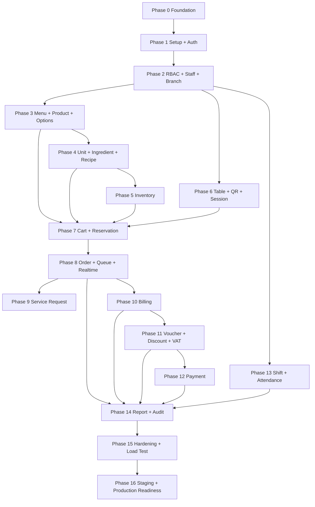

# DEVELOPMENT PLAN - WEB ORDER QUAN NUOC/CA PHE

**Status:** COMPLETED  
**Version:** 1.0  
**Last updated:** 2026-09-10  
**Source priority:** SRS -> BUSINESS_RULES -> DATABASE -> API -> ARCHITECTURE -> Code

## 1. Project Development Strategy

Current repository inspection shows only `docs/` and `backend/prisma/` exist. Backend NestJS app and Frontend React app have not been scaffolded. Development must therefore start with foundation work, then implement vertical business modules in dependency order.

Strategy:

- Build backend and frontend foundations first.
- Keep PostgreSQL as source of truth for critical business state.
- Implement one independently testable phase at a time.
- Use database integration tests for concurrency, inventory, reservation, bill and payment flows.
- Use transactional outbox for realtime after commit.
- Do not introduce Redis into critical MVP logic.

## 2. Technology Stack

| Layer | Stack |
|---|---|
| Frontend | React, TypeScript, Vite, React Router, TanStack Query, Zustand, Tailwind CSS, shadcn/ui, react-i18next |
| Backend | Node.js, NestJS, TypeScript, REST API, Swagger/OpenAPI, class-validator, Prisma |
| Database | PostgreSQL on Supabase |
| Auth | Supabase Auth with Google OAuth |
| Realtime | Supabase Realtime Broadcast through transactional outbox |
| Storage | Supabase Storage |
| Scheduler | NestJS Scheduler or Supabase Cron-compatible worker |

## 3. Development Principles

- Backend is the source of truth for inventory, reservation, final price, VAT, discount, payment status, roles, permissions and session state.
- Frontend displays server-confirmed state and never performs critical business decisions.
- Critical mutations use PostgreSQL transactions and row locks where needed.
- No hard delete for orders, order items, bills, payments, inventory ledger, audit logs or attendance history.
- Realtime events are written to `realtime_outbox` inside the business transaction and broadcast only after commit.
- Each phase must pass its tests before the next dependent phase starts.

## 4. Dependency Graph

Billing and payment must not begin until order confirmation, inventory consumption and item status are stable.

## 5. Critical Path

| Module | Why it blocks the project | Required proof |
|---|---|---|
| Database | All critical business invariants depend on Prisma and PostgreSQL constraints/triggers | Migration runs on PostgreSQL; Prisma validate passes |
| Auth | Staff/admin access and setup depend on verified Supabase JWT mapping | JWT verification and `users.auth_user_id` mapping tests pass |
| RBAC | Every admin/staff API depends on permission guards | Guard tests prove permissions cannot be bypassed |
| Session | QR order flow requires one active table session | 200 concurrent QR scans create one session |
| Inventory | Menu availability, reservation and order consumption depend on correct stock | No negative stock and no overselling tests pass |
| Reservation | Customer cart correctness depends on per-item TTL and row locks | Last-stock race and TTL refresh tests pass |
| Order | Queue, billing and reporting depend on immutable order snapshots | Confirm-order transaction and status tests pass |
| Billing | Payment and session close depend on correct bill allocations | Split/merge/void allocation tests pass |
| Payment | Revenue and session close depend on full-payment state | Duplicate payment and idempotency tests pass |

## 6. Phase Plans

## Phase 0 — Project Foundation

### Objective
Create backend/frontend foundations without implementing large business features.

### Dependencies
Existing docs and Prisma schema/migration.

### Backend Tasks
- P0-BE-001 Scaffold NestJS app under `backend/` using the approved stack.
- P0-BE-002 Add config module with environment validation for DB, Supabase, JWT, CORS and app URL values.
- P0-BE-003 Add Prisma module and connection lifecycle.
- P0-BE-004 Add global ValidationPipe, exception filter, response envelope and error codes.
- P0-BE-005 Add request ID/correlation ID middleware and structured logging.
- P0-BE-006 Add Swagger/OpenAPI foundation.
- P0-BE-007 Add health check endpoint and readiness check for PostgreSQL.
- P0-BE-008 Add transaction helper abstraction for Prisma `$transaction`.
- P0-SEC-001 Add CORS, security headers and rate-limit foundation.

### Frontend Tasks
- P0-FE-001 Scaffold React + Vite + TypeScript under `frontend/`.
- P0-FE-002 Configure React Router, TanStack Query and Zustand.
- P0-FE-003 Configure Tailwind CSS, shadcn/ui and dark mode.
- P0-FE-004 Configure react-i18next for VI/EN.
- P0-FE-005 Add API client with request ID, auth headers and standard error handling.
- P0-FE-006 Create customer, staff and admin layout shells without feature pages.

### Database Work
- P0-DB-001 Run existing Prisma migration in local PostgreSQL.
- P0-DB-002 Add seed skeleton for roles/permissions only when Phase 1/2 needs it.

### API Endpoints
- `GET /health`
- Swagger route, for example `/api/docs`

### Business Rules
- BR-AUTH-001
- BR-IDEMPOTENCY-001

### Realtime Events
None.

### Security Requirements
Security headers, CORS allowlist, request ID, basic rate limit, no secrets in logs.

### Tests
- P0-TEST-001 Backend boot test.
- P0-TEST-002 Config validation tests for missing/invalid env.
- P0-TEST-003 Prisma connectivity integration test.
- P0-TEST-004 Frontend render smoke test.

### Deliverables
Backend and frontend apps start locally; Swagger and health check work.

### Definition of Done
Both apps build, lint and test; database connects; no business feature endpoints beyond health/docs.

### Risks
Misconfigured env, leaking setup token or Supabase secrets in logs.

### Not Included
Setup, auth login, staff approval, menu, inventory or order feature implementation.

## Phase 1 — First-Time Setup + Auth

### Objective
Implement first-time setup, Supabase JWT verification and basic staff identity flow.

### Dependencies
Phase 0.

### Backend Tasks
- P1-BE-001 Implement Supabase JWT verifier and identity extraction from `JWT.sub`.
- P1-BE-002 Implement setup status service reading `system_setup`.
- P1-BE-003 Implement one-time setup token verification using hash comparison.
- P1-BE-004 Implement first-time setup transaction creating branch, admin user, staff branch, ADMIN role assignment and audit log.
- P1-BE-005 Implement staff registration with `PENDING` account status.
- P1-BE-006 Implement `GET /auth/me` with memberships, roles, permissions and shift access placeholder.
- P1-BE-007 Implement normal logout handler shell that can update attendance once Phase 13 exists.
- P1-SEC-001 Add setup rate limit and ensure plaintext setup token is never logged.

### Frontend Tasks
- P1-FE-001 Add setup status route guard.
- P1-FE-002 Add setup screen with Google OAuth and setup token field.
- P1-FE-003 Add staff registration pending state.
- P1-FE-004 Add auth provider/session foundation using Supabase client.

### Database Work
- P1-DB-001 Seed `system_setup` singleton in migration/seed process if absent.
- P1-DB-002 Seed system roles and base permissions required by setup.
- P1-DB-003 Use `idempotency_keys` for `POST /setup`.

### API Endpoints
- `GET /setup/status`
- `POST /setup`
- `POST /auth/registrations`
- `GET /auth/me`
- `POST /auth/logout`

### Business Rules
- BR-SETUP-SECURITY-001
- BR-AUTH-001
- BR-IDEMPOTENCY-001

### Realtime Events
None required.

### Security Requirements
Verified Supabase JWT, setup token hash, setup rate limit, one-time setup lock, no first-login-admin rule.

### Tests
- P1-TEST-001 Unit test setup token verifier.
- P1-TEST-002 Integration test setup creates all required records atomically.
- P1-TEST-003 Database concurrency test: two setup requests, only one succeeds.
- P1-TEST-004 Auth mapping test rejects body-provided `authUserId`.
- P1-TEST-005 Frontend setup flow smoke test.

### Deliverables
First admin and first branch can be created exactly once; staff can register as pending.

### Definition of Done
Setup cannot be repeated; auth/me reflects identity and permissions; tests pass on PostgreSQL.

### Risks
Privilege takeover, duplicate setup, accepting unverified email, token leakage.

### Not Included
Staff approval UI beyond pending state, menu/inventory/order features.

## Phase 2 — RBAC + Staff + Branch

### Objective
Implement branch-scoped staff management and permission guards.

### Dependencies
Phase 1.

### Backend Tasks
- P2-BE-001 Implement permission guard using StaffBranch roles and permissions.
- P2-BE-002 Implement branch access guard using `X-Branch-Id`.
- P2-BE-003 Implement branch CRUD.
- P2-BE-004 Implement staff list/detail.
- P2-BE-005 Implement staff approve/reject.
- P2-BE-006 Implement lock/unlock/inactive status changes.
- P2-BE-007 Implement role CRUD and permission assignment.
- P2-BE-008 Implement last-admin protection.

### Frontend Tasks
- P2-FE-001 Add admin/staff shell navigation gated by permissions.
- P2-FE-002 Add staff approval and role assignment screens.
- P2-FE-003 Add branch selector.
- P2-FE-004 Add account locked/pending/rejected states.

### Database Work
- P2-DB-001 Seed canonical permissions from API.md.
- P2-DB-002 Seed default role-permission mappings.
- P2-DB-003 Add audit writes for user, role and branch mutations.

### API Endpoints
- `GET/POST/PATCH /branches`
- `GET /staff`, `GET /staff/:id`
- `POST /staff/:id/approval`
- `POST /staff/:id/rejection`
- `PATCH /staff/:id/status`
- `PUT /staff/:id/branches/:branchId/roles`
- `GET/POST/PATCH /roles`
- `GET /permissions`

### Business Rules
- BR-AUTH-001
- BR-IDEMPOTENCY-001

### Realtime Events
Optional staff/admin refresh event; not required for customer flow.

### Security Requirements
Backend guard is authoritative; UI hiding is not security. Protect last admin.

### Tests
- P2-TEST-001 Unit tests for permission resolution.
- P2-TEST-002 Integration tests for each staff status transition.
- P2-TEST-003 Security tests for branch isolation and forbidden actions.
- P2-TEST-004 Last-admin protection test.

### Deliverables
Admin can manage branches, staff, roles and permissions.

### Definition of Done
No protected endpoint can be accessed without correct branch membership and permission.

### Risks
Cross-branch data leakage, role escalation, locking the last admin.

### Not Included
Menu, inventory, QR/session and billing.

## Phase 3 — Menu + Product + Options

### Objective
Implement branch-scoped menu catalog and product option rules.

### Dependencies
Phase 2.

### Backend Tasks
- P3-BE-001 Implement category CRUD.
- P3-BE-002 Implement product CRUD with processing area and status.
- P3-BE-003 Implement option group/value CRUD.
- P3-BE-004 Implement product option rule replacement.
- P3-BE-005 Implement product image upload path handling through Supabase Storage.
- P3-BE-006 Implement product availability read model placeholder using active status plus later inventory hooks.

### Frontend Tasks
- P3-FE-001 Add admin category/product management screens.
- P3-FE-002 Add option group/value management screens.
- P3-FE-003 Add product option rule editor.
- P3-FE-004 Add image upload UI via Supabase Storage flow.
- P3-FE-005 Add customer menu read-only screen shell.

### Database Work
- P3-DB-001 Use `categories`, `products`, option tables and product-option relation tables.
- P3-DB-002 Verify branch-scope triggers reject cross-branch options.

### API Endpoints
- `GET /products`, `GET /products/:id`
- `POST/PATCH /products`
- `GET/POST/PATCH /option-groups`
- `GET/POST/PATCH /option-values`
- Product option rule endpoint from API.md

### Business Rules
- BR-AUTH-001

### Realtime Events
- `PRODUCT_AVAILABILITY_CHANGED` when product status affects availability.

### Security Requirements
Customer only reads active menu via QR later; admin mutation requires `MENU_MANAGE`.

### Tests
- P3-TEST-001 Product validation tests.
- P3-TEST-002 Option min/max/default tests.
- P3-TEST-003 Branch-scope integration tests.
- P3-TEST-004 Storage path validation tests.

### Deliverables
Admin can manage product catalog and options; customer menu can read products once QR auth exists.

### Definition of Done
Catalog APIs and screens work; no cross-branch option/product relationship is possible.

### Risks
Invalid option configurations, broken image permissions, exposing inactive products.

### Not Included
Recipe quantities, inventory availability, cart reservation.

## Phase 4 — Unit + Ingredient + Recipe

### Objective
Implement units, ingredient base units and versioned recipes.

### Dependencies
Phase 2 and Phase 3.

### Backend Tasks
- P4-BE-001 Implement Unit CRUD.
- P4-BE-002 Implement Ingredient CRUD with immutable base unit after ledger use.
- P4-BE-003 Implement ingredient allowed unit mapping.
- P4-BE-004 Implement unit conversion management to ingredient base unit.
- P4-BE-005 Implement recipe version creation for BASE, SIZE and ADD_ON.
- P4-BE-006 Implement recipe activation with one active recipe per target.
- P4-BE-007 Implement recipe resolver service for later cart/order phases.

### Frontend Tasks
- P4-FE-001 Add unit management UI.
- P4-FE-002 Add ingredient management UI.
- P4-FE-003 Add recipe version editor.
- P4-FE-004 Add recipe activation workflow with reason.

### Database Work
- P4-DB-001 Use `units`, `ingredients`, `ingredient_units`, `unit_conversions`, `recipes`, `recipe_items`.
- P4-DB-002 Verify conversion factor, dimension and active recipe constraints.

### API Endpoints
- `GET /units`, `POST/PATCH /units`
- `GET/POST/PATCH /ingredients`
- `GET/PUT /ingredients/:id/units/:unitId`
- `GET/POST /products/:id/recipes`
- `POST /recipes/:id/activation`

### Business Rules
- BR-UNIT-CONVERSION-001

### Realtime Events
- `PRODUCT_AVAILABILITY_CHANGED` after recipe activation.

### Security Requirements
`INVENTORY_ADJUST`, `RECIPE_READ`, `RECIPE_MANAGE`; do not expose recipe quantities to customers.

### Tests
- P4-TEST-001 Conversion validation unit tests.
- P4-TEST-002 Base-unit immutability integration test.
- P4-TEST-003 Active recipe uniqueness database test.
- P4-TEST-004 Recipe resolver tests for base + size + add-on.

### Deliverables
Recipes can be maintained in base units and resolved deterministically.

### Definition of Done
Recipe resolver returns correct ingredient requirements for product/options; all DB constraints pass.

### Risks
Wrong unit conversion, multiple active recipes, customer-visible recipe details.

### Not Included
Inventory balances, cart reservation and order consumption.

## Phase 5 — Inventory

### Objective
Implement inventory balances, ledger and stocktake workflows.

### Dependencies
Phase 4.

### Backend Tasks
- P5-BE-001 Implement inventory balance queries with computed available quantity.
- P5-BE-002 Implement IMPORT transaction with conversion snapshot.
- P5-BE-003 Implement manual ADJUSTMENT, WASTE, DAMAGED and STAFF_USE mutations.
- P5-BE-004 Implement stocktake draft/count/complete/cancel workflow.
- P5-BE-005 Implement immutable ledger query.
- P5-BE-006 Implement low-stock query.
- P5-BE-007 Implement inventory audit and outbox writes.

### Frontend Tasks
- P5-FE-001 Add inventory balance screen.
- P5-FE-002 Add import/adjustment forms.
- P5-FE-003 Add stocktake workflow screens.
- P5-FE-004 Add low-stock indicators.

### Database Work
- P5-DB-001 Use `inventories`, `inventory_transactions`, `stocktakes`, `stocktake_items`.
- P5-DB-002 Verify no physical quantity can go below reserved quantity.
- P5-DB-003 Persist import snapshot fields exactly as in DATABASE.md.

### API Endpoints
- `GET /inventory`
- `GET /inventory/:id`
- `GET /inventory-transactions`
- `POST /inventory-transactions`
- `GET/POST/PATCH /stocktakes`

### Business Rules
- BR-UNIT-CONVERSION-001
- BR-IDEMPOTENCY-001

### Realtime Events
- `INVENTORY_CHANGED`
- `PRODUCT_AVAILABILITY_CHANGED`

### Security Requirements
`INVENTORY_READ`, `INVENTORY_IMPORT`, `INVENTORY_ADJUST`, `STOCKTAKE_MANAGE`.

### Tests
- P5-TEST-001 Import conversion snapshot integration test.
- P5-TEST-002 Negative inventory rejection database test.
- P5-TEST-003 Ledger append-only database test.
- P5-TEST-004 Concurrent inventory adjustment test.
- P5-TEST-005 Stocktake completion posts correct ledger.

### Deliverables
Inventory module can import, adjust, count and report balances.

### Definition of Done
Inventory never goes negative, ledger is immutable, conversion snapshots are persisted.

### Risks
Inventory drift, incorrect stocktake delta, missing audit.

### Not Included
Cart reservation, order consumption and cancel RETURN/WASTE.

## Phase 6 — Table + QR + Session

### Objective
Implement tables, QR lifecycle and serving sessions.

### Dependencies
Phase 2.

### Backend Tasks
- P6-BE-001 Implement table CRUD.
- P6-BE-002 Implement QR generation, rotation and disable.
- P6-BE-003 Implement public QR validation.
- P6-BE-004 Implement auto-create-or-join session transaction.
- P6-BE-005 Implement session lock/payment-request state transitions.
- P6-BE-006 Implement transfer table.
- P6-BE-007 Implement session close guard integration.

### Frontend Tasks
- P6-FE-001 Add admin/staff table screen.
- P6-FE-002 Add QR management UI.
- P6-FE-003 Add customer QR entry flow.
- P6-FE-004 Add session state indicators for staff.

### Database Work
- P6-DB-001 Use `tables`, `table_qr_codes`, `table_sessions`.
- P6-DB-002 Verify one active QR per table and one non-closed session per table.

### API Endpoints
- `POST /qr-sessions`
- `GET/POST/PATCH /tables`
- `POST /tables/:id/qr-rotation`
- `POST /table-sessions/:id/transfer`
- `POST /table-sessions/:id/closure`

### Business Rules
- BR-QR-SESSION-001

### Realtime Events
- `SESSION_UPDATED`
- `SESSION_CLOSED`

### Security Requirements
Public QR rate limit; `TABLE_MANAGE`, `QR_MANAGE`, `SESSION_TRANSFER`, `SESSION_CLOSE`.

### Tests
- P6-TEST-001 QR disabled/inactive table rejection.
- P6-TEST-002 200 concurrent QR scans create one open session.
- P6-TEST-003 Transfer table concurrency test.
- P6-TEST-004 Session close rejects unpaid/unbilled/active-reservation state.

### Deliverables
QR scan creates or joins session; staff can manage tables and session state.

### Definition of Done
Session race and QR lifecycle tests pass on PostgreSQL.

### Risks
Duplicate active sessions, stale QR tokens, invalid session close.

### Not Included
Cart, reservation, order and billing UI beyond session shell.

## Phase 7 — Cart + Inventory Reservation

### Objective
Implement customer/staff cart and 10-minute per-item ingredient reservation.

### Dependencies
Phase 3, Phase 4, Phase 5 and Phase 6.

### Backend Tasks
- P7-BE-001 Implement cart creation/lookup by QR session and browser/client instance.
- P7-BE-002 Implement add cart item with recipe resolution and inventory reservation.
- P7-BE-003 Implement update cart item with per-item TTL refresh rules.
- P7-BE-004 Implement note-only update without TTL refresh.
- P7-BE-005 Implement delete cart item and release reservation.
- P7-BE-006 Implement reservation expiration scheduler using `FOR UPDATE SKIP LOCKED`.
- P7-BE-007 Emit inventory and product availability events after commit.

### Frontend Tasks
- P7-FE-001 Add customer cart store and server sync.
- P7-FE-002 Add add/update/delete cart item UI.
- P7-FE-003 Show reservation expiry and unavailable item state.
- P7-FE-004 Add staff-assisted order cart flow.

### Database Work
- P7-DB-001 Use `carts`, `cart_items`, `cart_item_options`, `inventory_reservations`.
- P7-DB-002 Verify reservation trigger updates `reserved_quantity`.
- P7-DB-003 Verify expired reservations are terminal and not revived.

### API Endpoints
- `POST /cart/items`
- `PATCH /cart/items/:id`
- `DELETE /cart/items/:id`
- Cart read endpoint implied by API.md cart section.
- Internal scheduler for reservation expiration.

### Business Rules
- BR-RESERVATION-REFRESH-001
- BR-UNIT-CONVERSION-001
- BR-IDEMPOTENCY-001

### Realtime Events
- `INVENTORY_CHANGED`
- `PRODUCT_AVAILABILITY_CHANGED`

### Security Requirements
QR session or `ORDER_CREATE`; strict rate limit for public cart mutation.

### Tests
- P7-TEST-001 Add item sets expiry to now + 10 minutes.
- P7-TEST-002 Quantity/size/topping update resets only that item TTL.
- P7-TEST-003 Note update does not reset TTL.
- P7-TEST-004 GET cart does not reset TTL.
- P7-TEST-005 Expired reservation update checks stock again.
- P7-TEST-006 Two customers competing for final stock: only one succeeds.

### Deliverables
Cart reservation protects inventory and customer sees availability updates.

### Definition of Done
All TTL and last-stock concurrency tests pass on PostgreSQL.

### Risks
Overselling, accidental TTL refresh, abandoned reservations, deadlocks.

### Not Included
Confirm order, kitchen/bar queue, billing.

## Phase 8 — Order + Bar/Kitchen + Realtime

### Objective
Confirm carts into orders, consume inventory and operate bar/kitchen queues.

### Dependencies
Phase 7.

### Backend Tasks
- P8-BE-001 Implement confirm cart to order transaction.
- P8-BE-002 Create order, order item and option snapshots.
- P8-BE-003 Consume reservations and decrement physical inventory.
- P8-BE-004 Insert `ORDER_CONSUMPTION` ledger rows.
- P8-BE-005 Implement order detail and session order history.
- P8-BE-006 Implement order item status transitions.
- P8-BE-007 Implement bar/kitchen queue queries with urgency timing.
- P8-BE-008 Implement cancel order item with RETURN/WASTE policy.
- P8-BE-009 Implement print ticket MVP data endpoint/format if needed by UI.
- P8-BE-010 Implement outbox worker for realtime broadcasts.

### Frontend Tasks
- P8-FE-001 Add customer confirm order flow and order status screen.
- P8-FE-002 Add bar queue screen.
- P8-FE-003 Add kitchen queue screen.
- P8-FE-004 Add staff status update actions.
- P8-FE-005 Add waiter served action.
- P8-FE-006 Add ticket print view.

### Database Work
- P8-DB-001 Use `orders`, `order_items`, `order_item_options`, `order_item_status_history`.
- P8-DB-002 Use reservation and inventory ledger triggers safely.
- P8-DB-003 Verify one cancel effect per order item.

### API Endpoints
- `POST /orders`
- `GET /orders/:id`
- `GET /table-sessions/:id/orders`
- `PATCH /order-items/:id/status`
- `POST /order-items/:id/cancellation`
- `GET /bar/queue`
- `GET /kitchen/queue`

### Business Rules
- BR-ORDER-CANCEL-001
- BR-RESERVATION-REFRESH-001
- BR-IDEMPOTENCY-001

### Realtime Events
- `ORDER_CREATED`
- `ORDER_ITEM_STATUS_CHANGED`
- `INVENTORY_CHANGED`
- `PRODUCT_AVAILABILITY_CHANGED`

### Security Requirements
QR session or staff `ORDER_CREATE`; area-based queue access; `ORDER_CANCEL` required for cancellation.

### Tests
- P8-TEST-001 Confirm order consumes reservation exactly once.
- P8-TEST-002 Duplicate confirm with same cart/idempotency does not create duplicate order.
- P8-TEST-003 Status transition tests NEW -> PREPARING -> READY -> SERVED.
- P8-TEST-004 Cancel NEW creates one RETURN ledger.
- P8-TEST-005 Cancel PREPARING/READY creates WASTE and no stock restore.
- P8-TEST-006 Realtime outbox emits after commit only.

### Deliverables
Customer can place orders; bar/kitchen receive and process items.

### Definition of Done
Order transaction, queues, realtime and cancellation rules pass integration tests.

### Risks
Double consumption, incorrect snapshots, realtime before rollback, queue permission bypass.

### Not Included
Billing, payment, service requests except order status.

## Phase 9 — Service Request

### Objective
Implement customer call-staff and request-payment workflow.

### Dependencies
Phase 6 and Phase 8.

### Backend Tasks
- P9-BE-001 Implement service request creation for QR sessions.
- P9-BE-002 Implement staff request queue.
- P9-BE-003 Implement acknowledge/resolve status transitions.
- P9-BE-004 Add cooldown/anti-spam policy per session/type.
- P9-BE-005 Emit realtime events after commit.

### Frontend Tasks
- P9-FE-001 Add customer Call Staff and Request Payment buttons.
- P9-FE-002 Add staff request queue.
- P9-FE-003 Add request acknowledgement/resolution UI.

### Database Work
- P9-DB-001 Use `service_requests`.
- P9-DB-002 Add audit only if request handling policy requires it later.

### API Endpoints
- `POST /service-requests`
- `GET /service-requests`
- `PATCH /service-requests/:id/status`

### Business Rules
- BR-QR-SESSION-001

### Realtime Events
- `SERVICE_REQUEST_CREATED`
- `SERVICE_REQUEST_UPDATED`
- `PAYMENT_REQUESTED` if request type is payment.

### Security Requirements
QR session for create; `SERVICE_REQUEST_READ` and `SERVICE_REQUEST_HANDLE` for staff.

### Tests
- P9-TEST-001 Customer can create request only for own session.
- P9-TEST-002 Cooldown prevents spam.
- P9-TEST-003 Status transition integration tests.
- P9-TEST-004 Realtime event test.

### Deliverables
Staff can receive and handle customer requests.

### Definition of Done
Request create/queue/handle and realtime tests pass.

### Risks
Spam, stale requests, cross-session visibility.

### Not Included
Bill creation/payment implementation.

## Phase 10 — Billing

### Objective
Implement bill creation, issuing, split, merge and void.

### Dependencies
Phase 8.

### Backend Tasks
- P10-BE-001 Implement create draft bill from unbilled order item quantities.
- P10-BE-002 Implement bill item allocation service.
- P10-BE-003 Implement issue bill.
- P10-BE-004 Implement split bill.
- P10-BE-005 Implement merge bill.
- P10-BE-006 Implement void bill.
- P10-BE-007 Implement move quantity between unpaid bills if needed by split UI.
- P10-BE-008 Implement bill total recalculation without discounts first.

### Frontend Tasks
- P10-FE-001 Add cashier bill list by session.
- P10-FE-002 Add bill creation and issue UI.
- P10-FE-003 Add split bill UI.
- P10-FE-004 Add merge bill UI.
- P10-FE-005 Add void bill UI with reason.

### Database Work
- P10-DB-001 Use `bills` and `bill_items`.
- P10-DB-002 Verify allocation trigger prevents over-allocation.
- P10-DB-003 Verify `MERGED` source bills preserve history.
- P10-DB-004 Verify VOID releases allocation by excluding VOID from effective allocation.

### API Endpoints
- `POST /bills`
- `POST /bills/:id/splits`
- `POST /bills/merges`
- `POST /bills/:id/voidance`
- `POST /bills/:id/issuance`
- `GET /table-sessions/:id/bills` if added to implementation to support UI.

### Business Rules
- BR-BILL-SPLIT-001
- BR-BILL-MERGE-001
- BR-BILL-VOID-001
- BR-IDEMPOTENCY-001

### Realtime Events
- `BILL_UPDATED`
- `BILL_MERGED`
- `BILL_VOIDED`

### Security Requirements
`BILL_MANAGE`, `BILL_SPLIT`, `BILL_MERGE`, `BILL_ISSUE`, `BILL_VOID`.

### Tests
- P10-TEST-001 Create bill does not over-allocate.
- P10-TEST-002 Split bill preserves total allocated quantities.
- P10-TEST-003 Merge bill moves items, marks sources `MERGED` and recalculates total.
- P10-TEST-004 Merge rejects different-session bills.
- P10-TEST-005 Void bill leaves order intact and releases allocation.
- P10-TEST-006 Paid bill cannot be split/merged/voided.

### Deliverables
Cashier can create, issue, split, merge and void unpaid bills.

### Definition of Done
All allocation, merge and void database tests pass.

### Risks
Over-allocation, losing bill history, merging totals incorrectly.

### Not Included
Voucher, discount, VAT finalization and payment.

## Phase 11 — Voucher + Discount + VAT

### Objective
Implement bill adjustments, voucher/direct discount rules and VAT rounding.

### Dependencies
Phase 10.

### Backend Tasks
- P11-BE-001 Implement voucher CRUD.
- P11-BE-002 Implement voucher validation by status, dates, usage limit and minimum subtotal.
- P11-BE-003 Implement voucher application.
- P11-BE-004 Implement direct discount application.
- P11-BE-005 Implement discount override with actor/reason/before/after.
- P11-BE-006 Implement adjustment reversal.
- P11-BE-007 Implement VAT calculation with `ROUND(vat_raw, 0)`.
- P11-BE-008 Recalculate bill totals after bill item or adjustment changes.

### Frontend Tasks
- P11-FE-001 Add voucher management UI.
- P11-FE-002 Add cashier voucher application UI.
- P11-FE-003 Add direct discount UI with required reason.
- P11-FE-004 Add override reason flow for Manager/Admin.
- P11-FE-005 Show VAT and total breakdown.

### Database Work
- P11-DB-001 Use `vouchers` and `bill_adjustments`.
- P11-DB-002 Verify active adjustment uniqueness per source.
- P11-DB-003 Verify override fields are required when `is_override = true`.
- P11-DB-004 Verify VAT constraint rounds to zero decimal places.

### API Endpoints
- `GET/POST/PATCH /vouchers`
- `POST /bills/:id/voucher-applications`
- `POST /bills/:id/direct-discounts`
- `POST /bill-adjustments/:id/reversal`

### Business Rules
- BR-DISCOUNT-001
- BR-VAT-001
- BR-BILL-MERGE-001

### Realtime Events
- `BILL_UPDATED`

### Security Requirements
`VOUCHER_MANAGE`, `DISCOUNT_APPLY`, `DISCOUNT_OVERRIDE`; reason required for direct discount and override.

### Tests
- P11-TEST-001 Voucher percent/fixed amount calculation.
- P11-TEST-002 Usage limit concurrency test.
- P11-TEST-003 Direct discount requires reason.
- P11-TEST-004 Voucher plus direct discount requires override.
- P11-TEST-005 Override stores actor/reason/before/after.
- P11-TEST-006 VAT decimal case rounds to 1 VND.
- P11-TEST-007 Merge with discounts reverses old adjustments and recalculates.

### Deliverables
Bills calculate voucher, direct discount, VAT and total correctly.

### Definition of Done
All discount, override and VAT tests pass on PostgreSQL.

### Risks
Incorrect totals, discount abuse, voucher usage race.

### Not Included
Payment capture/confirmation.

## Phase 12 — Payment

### Objective
Implement CASH and QR_MOCK full-payment workflow.

### Dependencies
Phase 10 and Phase 11.

### Backend Tasks
- P12-BE-001 Implement create payment for issued bill.
- P12-BE-002 Enforce amount equals `bill.total`.
- P12-BE-003 Enforce one active/succeeded payment per bill.
- P12-BE-004 Implement cash confirmation.
- P12-BE-005 Implement QR_MOCK confirmation/failure/expiry.
- P12-BE-006 Implement payment idempotency and provider reference handling.
- P12-BE-007 Update bill to `PAID` on successful full payment.
- P12-BE-008 Emit bill/payment/session realtime events.

### Frontend Tasks
- P12-FE-001 Add cashier payment method selection for CASH/QR_MOCK.
- P12-FE-002 Add payment status view.
- P12-FE-003 Add cash confirm/fail action.
- P12-FE-004 Add QR_MOCK display and refresh.

### Database Work
- P12-DB-001 Use `payments`, `bills`, `idempotency_keys`.
- P12-DB-002 Verify `payments_one_active_or_success_per_bill`.
- P12-DB-003 Verify payment transition trigger.

### API Endpoints
- `POST /payments`
- `POST /payments/:id/confirmation`
- `GET /payments/:id`

### Business Rules
- BR-PAYMENT-001
- BR-IDEMPOTENCY-001
- BR-VAT-001

### Realtime Events
- `BILL_UPDATED`
- `BILL_PAID`
- `SESSION_UPDATED`

### Security Requirements
`PAYMENT_CREATE`, `PAYMENT_CONFIRM`, `PAYMENT_READ`; no partial or mixed payment.

### Tests
- P12-TEST-001 Create payment rejects DRAFT bill.
- P12-TEST-002 Two payment creates at same time: only one succeeds.
- P12-TEST-003 Confirm payment repeated: no double payment.
- P12-TEST-004 Payment amount mismatch rejected.
- P12-TEST-005 Successful payment sets bill PAID.
- P12-TEST-006 Mixed/partial payment attempts rejected.

### Deliverables
Cashier can collect full bill payment with CASH or QR_MOCK.

### Definition of Done
Duplicate payment, idempotency and full-payment tests pass.

### Risks
Double payment, paid bill mutation, stale QR mock state.

### Not Included
Real bank/VNPay/MoMo/ZaloPay integration.

## Phase 13 — Shift + Attendance

### Objective
Implement shift scheduling, check-in/out, auto checkout and manual adjustment.

### Dependencies
Phase 2.

### Backend Tasks
- P13-BE-001 Implement shift CRUD with nullable `graceMinutes`.
- P13-BE-002 Implement shift assignment CRUD.
- P13-BE-003 Implement check-in with source `NORMAL_LOGIN`.
- P13-BE-004 Implement normal check-out with source `NORMAL_LOGOUT`.
- P13-BE-005 Implement overnight interval calculation.
- P13-BE-006 Implement auto checkout scheduler using effective grace period.
- P13-BE-007 Implement manual attendance adjustment with audit.
- P13-BE-008 Implement late, early leave and duration calculations.

### Frontend Tasks
- P13-FE-001 Add shift management screens.
- P13-FE-002 Add shift assignment calendar/list.
- P13-FE-003 Add self check-in/check-out UI.
- P13-FE-004 Add attendance adjustment UI for Manager/Admin.
- P13-FE-005 Add attendance status display.

### Database Work
- P13-DB-001 Use `shifts`, `shift_assignments`, `attendances`.
- P13-DB-002 Verify attendance source constraints.
- P13-DB-003 Persist audit for manual adjustment and auto checkout.

### API Endpoints
- `GET/POST/PATCH /shifts`
- `GET/POST/PATCH /shift-assignments`
- `POST /attendances/check-ins`
- `POST /attendances/:id/check-out`
- `POST /attendances/auto-checkout-runs`
- `PATCH /attendances/:id`

### Business Rules
- BR-ATTENDANCE-001

### Realtime Events
- `ATTENDANCE_UPDATED`

### Security Requirements
Self check-in/out only for current user; `SHIFT_MANAGE`, `ATTENDANCE_READ`, `ATTENDANCE_ADJUST`.

### Tests
- P13-TEST-001 Overnight shift end calculation.
- P13-TEST-002 Normal logout uses server time and `NORMAL_LOGOUT`.
- P13-TEST-003 Auto checkout stores scheduled shift end, not scheduler run time.
- P13-TEST-004 Grace period branch default vs shift override.
- P13-TEST-005 Manual adjustment requires reason and audit.

### Deliverables
Staff attendance and manager adjustment workflows are usable.

### Definition of Done
Overnight, normal logout, auto checkout and manual adjustment tests pass.

### Risks
Wrong timezone, wrong auto checkout timestamp, attendance tampering.

### Not Included
Payroll or advanced HR features.

## Phase 14 — Report + Audit

### Objective
Implement core reports and audit log access.

### Dependencies
Phase 8, Phase 10, Phase 11, Phase 12 and Phase 13.

### Backend Tasks
- P14-BE-001 Implement revenue overview report.
- P14-BE-002 Implement order statistics.
- P14-BE-003 Implement best seller and product revenue report.
- P14-BE-004 Implement cancel item report.
- P14-BE-005 Implement discount and VAT report.
- P14-BE-006 Implement inventory usage and waste report.
- P14-BE-007 Implement attendance report.
- P14-BE-008 Implement audit log query with redaction.
- P14-BE-009 Implement CSV/XLSX export jobs.

### Frontend Tasks
- P14-FE-001 Add dashboard overview.
- P14-FE-002 Add product/order report screens.
- P14-FE-003 Add inventory/waste report screen.
- P14-FE-004 Add attendance report screen.
- P14-FE-005 Add audit log screen.
- P14-FE-006 Add export controls.

### Database Work
- P14-DB-001 Use existing source tables; do not create separate source-of-truth report tables in MVP.
- P14-DB-002 Review report query indexes.

### API Endpoints
- `GET /reports/overview`
- `GET /reports/products`
- `GET /reports/inventory`
- `GET /reports/attendance`
- `POST /report-exports`
- `GET /audit-logs`

### Business Rules
- BR-ORDER-CANCEL-001
- BR-DISCOUNT-001
- BR-VAT-001
- BR-PAYMENT-001
- BR-ATTENDANCE-001

### Realtime Events
None required; reports use REST snapshots.

### Security Requirements
`REPORT_READ`, `REPORT_EXPORT`, `AUDIT_READ`; redact sensitive audit data by permission.

### Tests
- P14-TEST-001 Revenue includes PAID bills only.
- P14-TEST-002 VOID/MERGED bills are excluded from effective revenue.
- P14-TEST-003 VAT and discount report match bill snapshots.
- P14-TEST-004 Inventory usage derives from ledger.
- P14-TEST-005 Audit log append-only and redaction tests.
- P14-TEST-006 Export format tests for CSV/XLSX.

### Deliverables
Admin/Manager can view core operational reports and audit history.

### Definition of Done
Reports reconcile with source data and exports are correct.

### Risks
Slow queries, exposing sensitive audit payloads, revenue mismatch.

### Not Included
Advanced BI warehouse or real-time analytics dashboard.

## Phase 15 — Hardening + Load Test

### Objective
Harden security, concurrency and performance before staging.

### Dependencies
Phase 14.

### Backend Tasks
- P15-BE-001 Review all authorization guards.
- P15-BE-002 Review all critical transactions and lock ordering.
- P15-BE-003 Add retry strategy for known serialization/deadlock cases where safe.
- P15-BE-004 Review indexes and slow queries.
- P15-BE-005 Harden outbox worker reconnect and retry.
- P15-BE-006 Review idempotency expiry and cleanup.

### Frontend Tasks
- P15-FE-001 Test error states and reconnect behavior.
- P15-FE-002 Validate mobile customer UX and tablet/desktop staff UX.
- P15-FE-003 Verify no client-side bypass assumptions.

### Database Work
- P15-DB-001 Run EXPLAIN ANALYZE on critical queries.
- P15-DB-002 Run database integrity checks for duplicate sessions/orders/payments/allocations.
- P15-DB-003 Tune indexes based on benchmark evidence only.

### API Endpoints
All MVP endpoints.

### Business Rules
All business rules.

### Realtime Events
All realtime events and reconnect/refetch behavior.

### Security Requirements
Input fuzzing, rate limit tests, branch isolation, QR token abuse tests, permission bypass tests.

### Tests
- P15-TEST-001 200 concurrent menu readers.
- P15-TEST-002 200 concurrent QR scans.
- P15-TEST-003 200 concurrent add-to-cart requests.
- P15-TEST-004 200 concurrent order confirmations.
- P15-TEST-005 Last-stock race condition.
- P15-TEST-006 Duplicate order/payment idempotency load tests.
- P15-TEST-007 Security and input fuzz tests.

### Deliverables
Hardening report with p50/p95/p99, success rate, error rate, CPU, memory, DB connections, deadlocks, timeouts and data corruption checks.

### Definition of Done
Load tests do not crash the system or corrupt data; any performance target is documented as benchmark-based, not guessed.

### Risks
Deadlocks, DB connection exhaustion, slow report queries, realtime reconnect gaps.

### Not Included
Production deployment.

## Phase 16 — Staging + Production Readiness

### Objective
Prepare staging and production operations without changing business requirements.

### Dependencies
Phase 15.

### Backend Tasks
- P16-BE-001 Add deployment-ready environment profiles.
- P16-BE-002 Add migration runbook and rollback notes.
- P16-BE-003 Add production health/readiness checks.
- P16-BE-004 Add seed strategy for roles, permissions, setup singleton and base units.

### Frontend Tasks
- P16-FE-001 Configure staging/production frontend environment variables.
- P16-FE-002 Run smoke tests for customer, staff and admin routes.
- P16-FE-003 Verify dark mode and i18n in production build.

### Database Work
- P16-DB-001 Define backup and restore procedure.
- P16-DB-002 Verify migration procedure on staging clone.
- P16-DB-003 Verify connection pooling configuration.

### API Endpoints
All MVP endpoints; health and Swagger routes.

### Business Rules
All business rules must remain unchanged.

### Realtime Events
Verify production channel naming and outbox worker operation.

### Security Requirements
HTTPS, secret management, Supabase keys separation, storage bucket policies, CORS allowlist, rate-limit config.

### Tests
- P16-TEST-001 Staging smoke test.
- P16-TEST-002 Migration rollback rehearsal.
- P16-TEST-003 Backup/restore rehearsal.
- P16-TEST-004 Production checklist review.

### Deliverables
Staging environment, deployment checklist, migration runbook, rollback runbook and smoke test evidence.

### Definition of Done
Staging is green, production checklist is complete and MVP can be deployed with rollback path.

### Risks
Secret leakage, missing backups, migration failure, incorrect Supabase policies.

### Not Included
Real payment provider integrations or post-MVP features.

## 7. Test Strategy

| Test type | Scope | Required for |
|---|---|---|
| Unit Test | Pure services, validators, guards, calculators | setup token verifier, permission resolver, recipe resolver, VAT/discount calculators |
| Integration Test | NestJS modules with database transaction boundary | setup, auth, RBAC, menu, recipe, inventory, order, bill, payment |
| Database Integration Test | PostgreSQL constraints/triggers/functions | session uniqueness, reservation counter, bill allocation, payment uniqueness, append-only history |
| E2E Test | Browser/API path across customer/staff/admin | QR -> cart -> order -> queue -> bill -> payment -> session close |
| Concurrency Test | Parallel requests against PostgreSQL | setup, QR scan, last-stock reservation, confirm order, split/merge/void bill, payment |
| Load Test | System throughput and stability | 200 menu readers, QR scans, add-to-cart, order confirmations |
| Security Test | Auth, RBAC, branch isolation, fuzzing | all protected endpoints and public QR/cart endpoints |

Critical business flows must be tested on PostgreSQL, not only mocked Prisma.

## 8. Security Strategy

- Verify Supabase JWT for staff/admin; map identity from `JWT.sub`.
- Use QR session tokens only for customer-scoped actions.
- Enforce `X-Branch-Id` with staff branch membership.
- Check permissions in backend guards for every protected endpoint.
- Apply rate limits to setup, QR session, cart mutation, service request and auth endpoints.
- Never log setup token, JWT, QR session token, provider secrets or sensitive audit payloads.
- Redact audit data by viewer permission.
- Keep Supabase service role key server-side only.

## 9. Load Test Strategy

Initial benchmark scenarios:

- 200 concurrent menu readers.
- 200 concurrent QR scans for the same table.
- 200 concurrent add-to-cart requests for constrained inventory.
- 200 concurrent order confirmations.
- Last-stock race condition with exact inventory for one item.

Metrics:

- success rate, error rate, p50, p95, p99
- CPU, memory, DB connections
- deadlocks, lock wait, timeout
- duplicate session, duplicate order, duplicate payment
- overselling or allocation corruption

Targets should be proposed after staging benchmark data. Do not invent unrealistic targets before infrastructure is known.

## 10. Staging Strategy

- Use a separate staging Supabase project or isolated PostgreSQL database.
- Use separate Supabase Auth redirect URLs and Storage buckets.
- Run migrations on staging before production.
- Seed roles, permissions, setup singleton and base units.
- Run full smoke test and selected concurrency tests after each staging deploy.
- Keep staging secrets separate from development and production.

## 11. Production Readiness

Checklist:

- HTTPS enabled.
- CORS allowlist configured.
- Database connection pooling configured.
- Secrets stored outside source code.
- Backup and restore procedure tested.
- Migration and rollback runbook written.
- Health/readiness checks monitored.
- Outbox worker monitored.
- Rate limits enabled.
- Storage bucket policies verified.
- First-time setup token generated securely and not logged.
- Smoke test covers customer, staff and admin critical paths.

## 12. Definition of Done

MVP is complete only when:

- Customer scan QR works.
- Session auto-open works.
- Menu displays correctly.
- Cart works.
- Reservation 10 minutes works.
- Inventory overselling is impossible under tested concurrency.
- Confirm Order works.
- Bar/Kitchen receive realtime orders.
- Item status works.
- Cancel item RETURN/WASTE works.
- Call Staff works.
- Request Payment works.
- Bill works.
- Split Bill works.
- Merge Bill works.
- Void Bill follows rules.
- Voucher/Discount/VAT are correct.
- CASH and QR_MOCK payment work.
- Mixed/partial payment is rejected.
- Session close rules work.
- Shift/Attendance works.
- Audit is complete for critical actions.
- Core reports work.
- Permissions cannot be bypassed.
- Critical transactions are concurrency-safe.
- 200 concurrent load tests do not crash or corrupt data.

## 13. Phase Checklist

| Phase | Gate before next dependent phase |
|---|---|
| P0 | Apps scaffolded, health/db checks pass |
| P1 | Setup/auth tests pass |
| P2 | RBAC and branch isolation tests pass |
| P3 | Menu/options branch-scope tests pass |
| P4 | Unit/recipe resolver tests pass |
| P5 | Inventory ledger and no-negative-stock tests pass |
| P6 | QR/session concurrency tests pass |
| P7 | Reservation TTL and last-stock tests pass |
| P8 | Order consume/status/cancel/realtime tests pass |
| P9 | Service request lifecycle tests pass |
| P10 | Split/merge/void allocation tests pass |
| P11 | Discount/override/VAT tests pass |
| P12 | Payment idempotency and duplicate protection tests pass |
| P13 | Overnight/auto-checkout/manual-adjustment tests pass |
| P14 | Reports reconcile with source data |
| P15 | Load/security hardening pass |
| P16 | Staging and production readiness checklist complete |

## 14. Risks

| Risk | Mitigation |
|---|---|
| Duplicate setup/admin | Singleton setup row, token hash, idempotency and concurrency test |
| Cross-branch data leak | Branch guard, scope triggers and integration tests |
| Overselling inventory | Reservation trigger, inventory row locks, last-stock tests |
| Duplicate order | `orders.cart_id` unique and idempotency |
| Incorrect cancel stock effect | One cancel ledger effect per order item and status-based policy tests |
| Bill over-allocation | Bill allocation trigger and split/merge/void tests |
| Duplicate payment | One active/succeeded payment index and idempotency |
| Incorrect VAT | Server calculator plus database constraint and decimal tests |
| Realtime inconsistency | Transactional outbox and after-commit worker tests |
| Attendance timezone errors | Branch timezone and overnight tests |
| Slow reports | Index review and benchmark-driven optimization |

## 15. BLOCKERS / OPEN QUESTIONS

None found in the current aligned documentation. If implementation reveals a contradiction, stop the affected phase and document it before changing business behavior.
